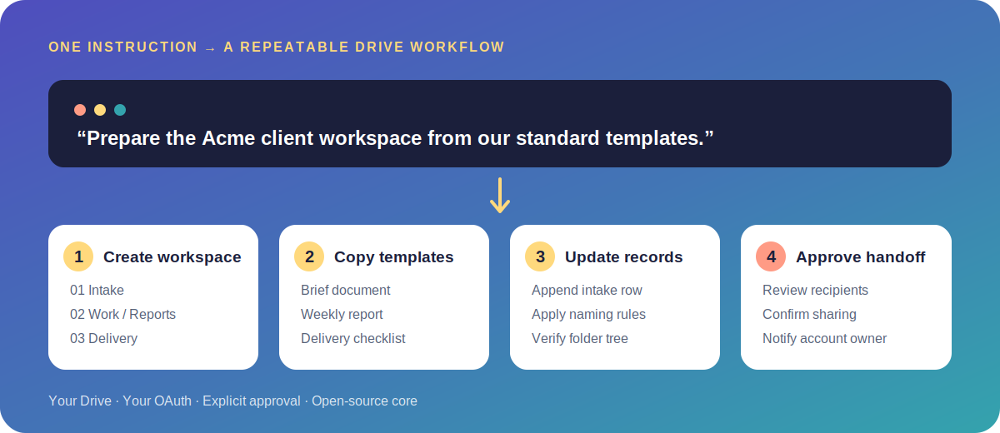

# Krakenfy Drive MCP

Turn repeated Google Drive work into one instruction.

Krakenfy Drive MCP is an open-source server that lets AI agents provision workspaces, reuse company
templates, inspect folder structures, update recurring reports, and deliver files through an OAuth
project controlled by the user. It does not depend on native ChatGPT or Claude connectors.

[](https://github.com/KrakenfyLLC/krakenfy-drive-mcp/actions/workflows/ci.yml)
[](LICENSE)
[](#capabilities)

**[Install it yourself](docs/INSTALL.md)** ·
**[Deploy it with Krakenfy](https://krakenfy.com/drive-agent/)** ·
**[Ask the community](https://github.com/KrakenfyLLC/krakenfy-drive-mcp/discussions)**



## Workflows it can automate

### Client onboarding

Create the complete account workspace, build nested folders, and copy the correct Docs, Sheets, and
Slides templates with consistent names in one tool call.

### Recurring reporting

Find source material, read bounded spreadsheet ranges, append new records, update reporting cells,
and place the finished deliverable in the correct folder.

### Drive audits and delivery handoffs

Map a nested folder tree, identify misplaced work, organize approved files, and share the final
folder with a person, group, or company domain after explicit confirmation.

## Why companies use the managed service

The MCP is free and open source. You can install and adapt it yourself.

Krakenfy offers an optional implementation service for teams that want a production-ready workflow
configured around their permissions, templates, operating process, and acceptance criteria. The
service can include:

- Client-owned Google Cloud and OAuth configuration.
- Workflow mapping around one measurable recurring task.
- Safeguards and human approval points.
- Validation with real client files and exception handling.
- Private deployment, documentation, training, and operational handoff.

**[See the managed deployment options →](https://krakenfy.com/drive-agent/)**

## Capabilities

The server exposes 17 bounded MCP tools:

| Area | Available operations |
| --- | --- |
| Discovery | Search files, list folders, inspect metadata, and audit nested folder trees |
| Content | Read or export text and download files without overwriting local paths |
| Workspaces | Create folders and provision nested workspaces from Drive templates |
| Organization | Upload, copy, move, rename, and recoverably trash files |
| Delivery | Share files or folders with a user, group, or domain after confirmation |
| Sheets | Read, update, and append rows to bounded spreadsheet ranges |
| Drive support | Paginated results and shared-drive operations |

## Example

```json
{
  "name": "Acme",
  "parentId": "customer-root-folder-id",
  "folderPaths": [
    "01 Intake",
    "02 Work/Research",
    "02 Work/Reports",
    "03 Delivery"
  ],
  "templates": [
    {
      "fileId": "report-template-id",
      "name": "Acme — Weekly Report",
      "targetFolderPath": "02 Work/Reports"
    }
  ]
}
```

Pass this to `drive_create_workspace` and the agent creates the repeatable structure and template
copies. It can then use `sheets_append_rows`, `drive_get_folder_tree`, and `drive_share_file` to
continue the workflow.

## Security model

- Credentials live outside the repository.
- Tokens are stored with `0600` permissions.
- Downloads never overwrite existing local files.
- Trash and sharing operations require `confirm: true`.
- Trash is recoverable through Google Drive.
- Text responses are limited to 2 MiB.
- Folder-tree reads have explicit depth and item limits.
- Every user supplies and controls their own Google Cloud project.

See [SECURITY.md](SECURITY.md) for vulnerability reporting and security details.

## Installation

Follow the [self-hosted installation guide](docs/INSTALL.md) to configure Google Cloud, authorize an
account, and connect a compatible MCP client.

For private implementation, workflow adaptations, or a team rollout, see
[managed deployment](https://krakenfy.com/drive-agent/).

## Community and support

- Use [Discussions](https://github.com/KrakenfyLLC/krakenfy-drive-mcp/discussions) for questions,
  workflow ideas, and examples.
- Use [Issues](https://github.com/KrakenfyLLC/krakenfy-drive-mcp/issues) for reproducible bugs and
  open-source feature requests.
- Use the [Krakenfy assessment](https://krakenfy.com/drive-agent/) for private installation,
  workflow design, and commercial inquiries.

## Development

```bash
npm ci
npm run check
npm test
```

## License

MIT. See [LICENSE](LICENSE).

This project is independent and is not endorsed by, sponsored by, or affiliated with Google.
Google Drive is a trademark of Google LLC.
